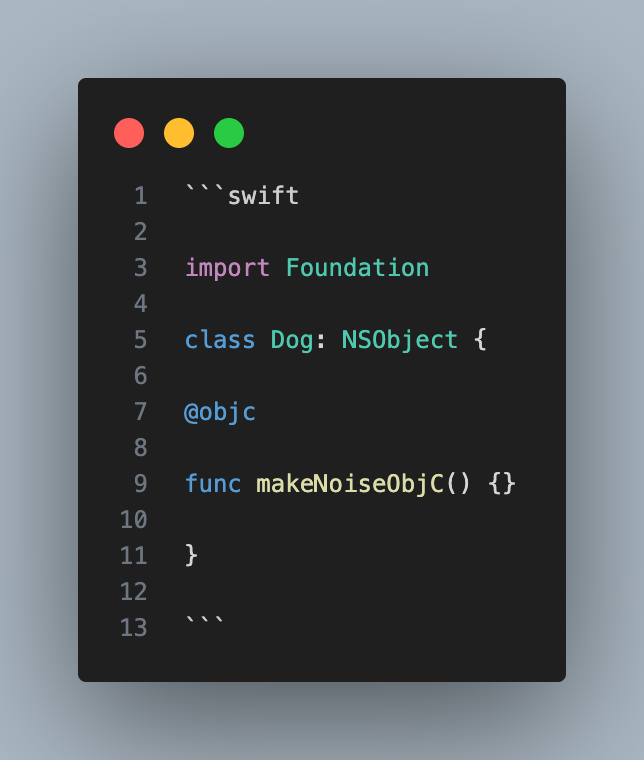
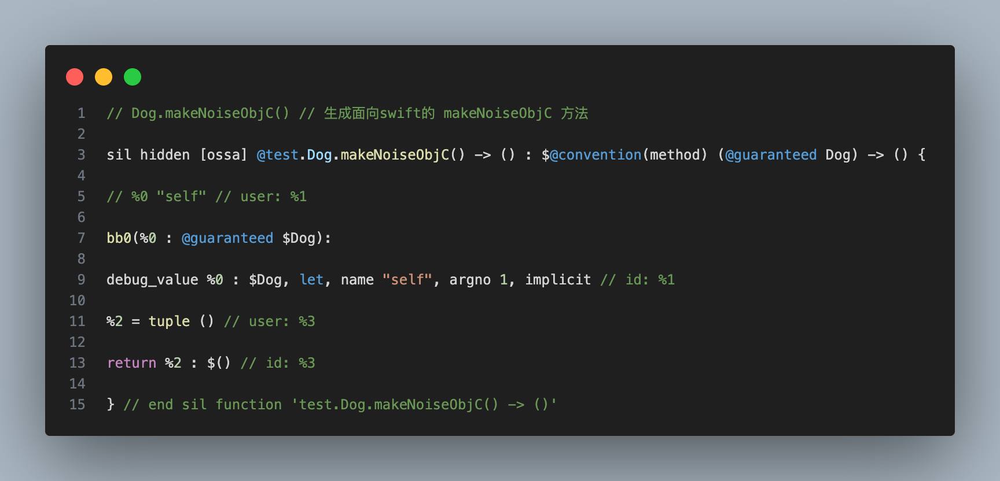
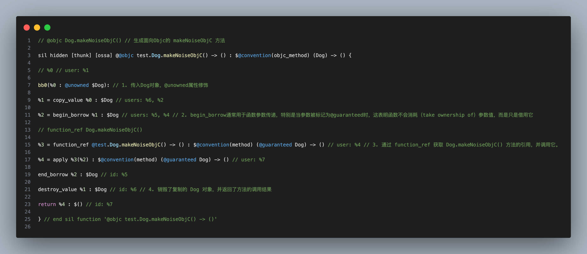
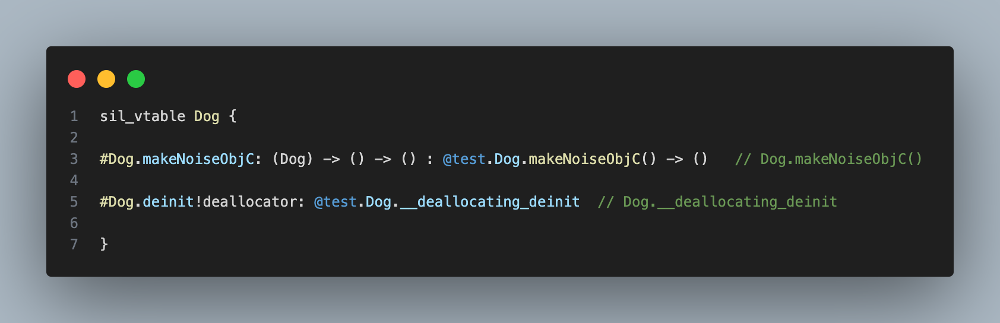

# [【Swift SIL代码分析系列】@objc & dynamic inside](https://juejin.cn/post/7428393187725033512)

> 配套Demo工程：
> 
> 1. clone `git@github.com:Nirvana-icy/DemoKit.git` 工程，切换到 /SIL 目录
> 
> 2. 在 test.swift 文件中输入Swift源码
> 
> 3. Terminal中执行以下编译指令
> 
> 
> ```swift
> 
> swiftc -emit-silgen -Onone test.swift | xcrun swift-demangle >> test.sil
> 
> ```
> 
> 4. 在 test.sil 查看输出


## @objc & dynamic inside

### Q1: 如何允许 Objective-C 代码调用 Swift 定义的方法？ 如何实现的?


A1: 使用 @objc属性。实现细节可以通过下面的例子进行说明。


#### 1. Swift源码：



#### 2. 生成SIL代码：

##### 2.1 生成面向swift的 makeNoiseObjC 方法



##### 2.2 生成面向Objc的 makeNoiseObjC 方法


  
通过 @objc 属性，Swift 方法可以被 Objective-C 代码调用，而 SIL 代码则负责处理这些互操作性的细节（见SIL代码中的注释）。

  


### Q2: @objc属性修饰的方法的派发方式是怎样的？


A2: v-table




#### Q3 dynamic 的作用？如何实现的？


1. dynamic 的作用：

使用了 dynamic 的 class （只有 class 可以 dynamic），会开启 message 模式，让 OC runtime 可以调用。

2. 实现原理：

`VTable 的变化`：在 Swift 中，每个类都有一个虚函数表（VTable），它包含了类中所有方法的引用。

对于 dynamic 方法，SIL 底部的 VTable 中不会包含该方法的引用，因为这个方法的实现可能在运行时改变，因此不能在编译时静态确定 。

---
Also avaliable in 掘金：[【Swift SIL代码分析系列】@objc & dynamic inside](https://juejin.cn/post/7428393187725033512)